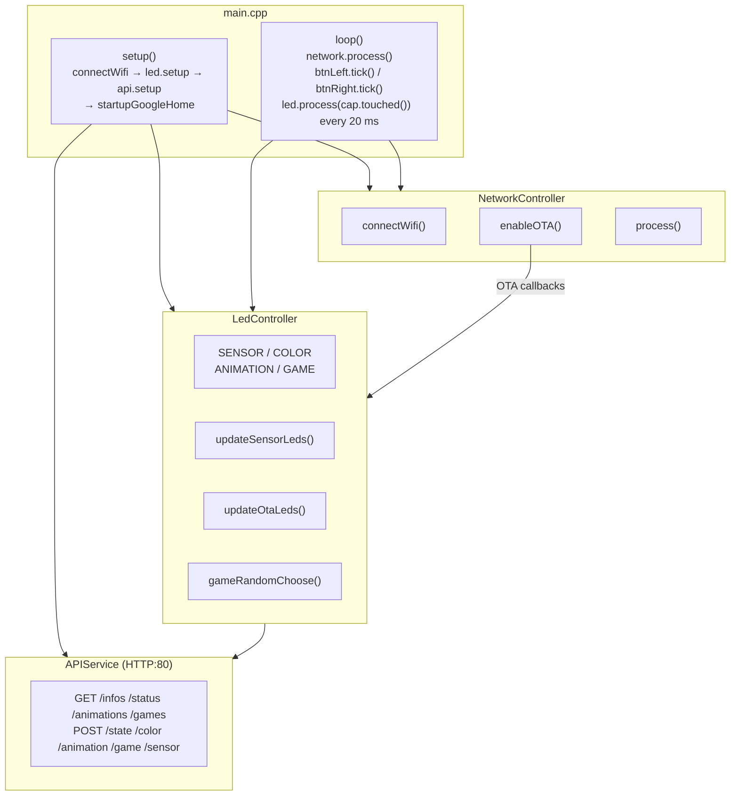

# Architecture Overview

## Source tree

```
src/
├── main.cpp                 # Entry point: setup() / loop()
├── controllers/
│   ├── LedController.h/.cpp # FastLED state machine
│   └── NetworkController.h/.cpp # Wi-Fi + OTA
└── service/
    ├── APIService.h/.cpp    # ESPAsyncWebServer REST API
```

## Component diagram



## Main loop timing

| Task                         | Interval  |
|------------------------------|-----------|
| OTA handle + button tick     | Every iteration |
| LED strip update             | Every 20 ms (~50 FPS) |
| Heartbeat LED_BUILTIN toggle | Every 1 s  |

